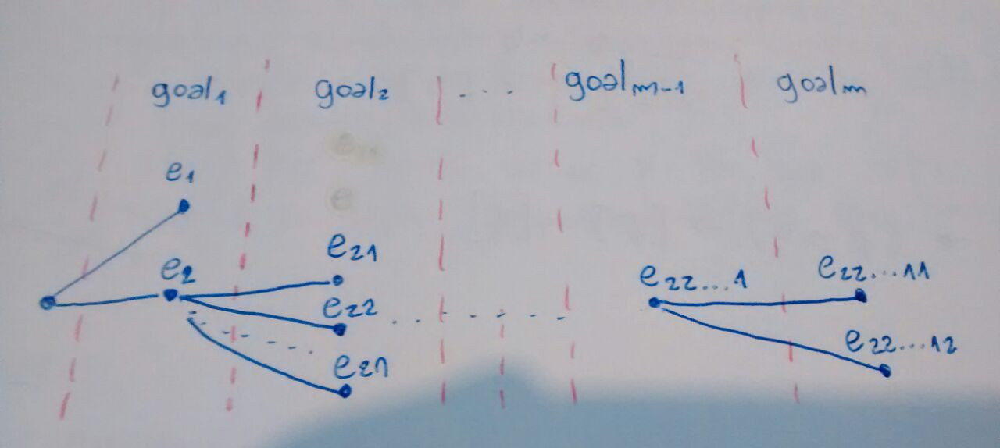

conde and condi
---------------

Offer us mechanisms to build computations
that may:

- Have no value (if they never end).
- Fail, if non of its rows succeeds.
- Succeed, if any of the rows succeeds.

The thing is that having more than one row,
will allow you to have more than one
success. If you nest conde/condi statements,
then you'll be able to produce infinite
successes or something that never ends.

Each success may tighten, in its own way,
the bindings of the variables of the
initial environment.

Syntax
------

Conde and condi have the same syntax,
where the `(else goal)` row is just sugar
for `(S goal)` and curly braces indicate
optional goals.

```
(cond
  (goal¹¹{ goal¹² goal¹³ ...})
  (goal²¹{ goal²² goal²³ ...})
  ...
  (else goal))
```

Success in a row
----------------

We'll think in a tree to figure out
how to retrieve successes from a row.



An edge represents a try to, given
an environment and a goal, produce a
new environment where already declared
variables may be tighten and new ones
introduced. The parent node must be an
environment, the child node is a fail
or an environment and the goal is the
one associated to the child node.
Given `g` goals, the node `n` has the
associated goal `height(n)`.

By this terms, if a node is a fail, it
must be a leaf and only leafs of height
`g` may be sucessful. Also notice that
the environment in which the cond is
declared is the root node.

So, to get the success number `s` in a row,
you'll traverse the tree in a depth first
manner, returning the environment associated
to the `s` successful leaf.

conde vs condi
--------------

*conde* and *condi* both traverse a row in
the same way to find success. But, once you
find one and want to retrieve another success,
*conde* will keep looking in the same row,
while *condi* will try in the next one, and
'remember' that already extracted one from
the previous row. Basically *conde* exhausts
a row before going to the next one and
*condi* interleaves between the non
exhausted rows. In a rough comparison:

```scheme
(run* (r)
  (conde
    ((conde
       ((== 'one r))
       ((== 'two r))))
    ((conde
       ((== 'three r))
       ((== 'four r))))))
;; '(one two three four)
```

```scheme
(run* (r)
  (condi
    ((conde
       ((== 'one r))
       ((== 'two r))))
    ((conde
       ((== 'three r))
       ((== 'four r))))))
;; '(one three two four)
```

Notice that the inner *conde* may be
replaced by *condi*'s, since they only have
an item per row, the behavior is the same.

run and alli
------------

*run* will look for success in the same way
that a *conde* or *condi* looks for success
in a row. Basically you'll do a depth first
search going through each row. An *alli*
declaration will iterate over each row.
You may use it when you want to prime the
success of the lower rows.
